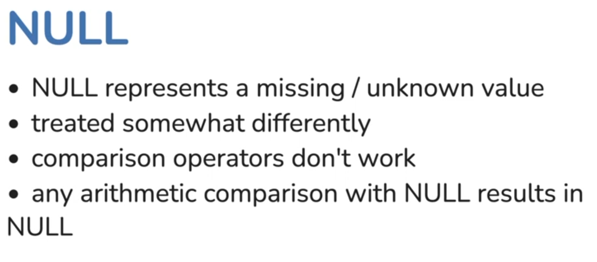

<!-- vscode-markdown-toc -->
* 1. [SQL](#SQL)
* 2. [MySQL setup on MacOS](#MySQLsetuponMacOS)
* 3. [Setup sample database](#Setupsampledatabase)
* 4. [SQL Commands](#SQLCommands)
* 5. [Data Definition Language(DDL): CREATE, ALTER, DROP](#DataDefinitionLanguageDDL:CREATEALTERDROP)
	* 5.1. [CREATE](#CREATE)
	* 5.2. [ALTER](#ALTER)
	* 5.3. [DROP](#DROP)
	* 5.4. [CREATING TABLES](#CREATINGTABLES)
		* 5.4.1. [DESIGN](#DESIGN)
* 6. [Data Manipulation Language (DML): SELECT, INSERT, UPDATE, DELETE](#DataManipulationLanguageDML:SELECTINSERTUPDATEDELETE)
	* 6.1. [SELECT](#SELECT)
	* 6.2. [INSERT](#INSERT)
	* 6.3. [Update](#Update)
	* 6.4. [Delete](#Delete)
	* 6.5. [NULL](#NULL)
	* 6.6. [Adding NULL Values](#AddingNULLValues)
	* 6.7. [Query Clauses](#QueryClauses)
	* 6.8. [Order of evaluation](#Orderofevaluation)
	* 6.9. [Table types](#Tabletypes)
	* 6.10. [Question : Select all the cites of India and United States](#Question:SelectallthecitesofIndiaandUnitedStates)
		* 6.10.1. [Possible Solutions :](#PossibleSolutions:)
	* 6.11. [Temporary Table](#TemporaryTable)
	* 6.12. [Concat](#Concat)
	* 6.13. [Virtual Table Example](#VirtualTableExample)
	* 6.14. [Question : Get all the cities of all the countries which has population more than 1700000](#Question:Getallthecitiesofallthecountrieswhichhaspopulationmorethan1700000)
		* 6.14.1. [Solution](#Solution)
	* 6.15. [Below three queries works the same way](#Belowthreequeriesworksthesameway)
* 7. [Data Control Language (DCL): GRANT, REVOKE](#DataControlLanguageDCL:GRANTREVOKE)

# Relational Databases and SQL 

##  1. <a name='SQL'></a>SQL 
```sql
CREATE TABLE Employees(
    ID INT PRIMARY KEY, 
    Name VARCHAR(50),
    Position VARCHAR(30),
    Department VARCHAR(50)
);

INSERT INTO Employees(ID, Name, Position, Department) VALUES(1,'John Doe','Software Engineer','Development');
```


##  2. <a name='MySQLsetuponMacOS'></a>MySQL setup on MacOS
```
brew install mysql

To start mysql now and restart at login:
        brew services start mysql

To connect run:
    mysql -u root
```

##  3. <a name='Setupsampledatabase'></a>Setup sample database
[Documentation link](https://dev.mysql.com/doc/index-other.html)
1. Download world database and Sakila(Movies) database as zip files
2. Import them using below command
3. `source path/file-schema.sql`
4. `source path/file-data.sql`

##  4. <a name='SQLCommands'></a>SQL Commands 
```sql
show databases; 

-- Use a particular database
use <databasename>; 
-- List all tables
show tables; 
-- Hello world equivalent, but returns a result set(Table)
select 'Hello World'; 

-- Current time 
select now(); 
```


##  5. <a name='DataDefinitionLanguageDDL:CREATEALTERDROP'></a>Data Definition Language(DDL): CREATE, ALTER, DROP

###  5.1. <a name='CREATE'></a>CREATE 
1. Used to create new Database or table
`CREATE DATABASE <database-name>; `
`CREATE TABLE TABLE_NAME(column1 datatype, column2 datatype ...); `


<br></br>
---

###  5.2. <a name='ALTER'></a>ALTER 

<br></br>
---

<br></br>
---

###  5.3. <a name='DROP'></a>DROP 

<br></br>
---

<br></br>
---

###  5.4. <a name='CREATINGTABLES'></a>CREATING TABLES 
`Creating a STUDENTS table`


<br></br>
---
####  5.4.1. <a name='DESIGN'></a>DESIGN


<br></br>
---

<br></br>
---

<br></br>
---

<br></br>
---

<br></br>
---

<br></br>
---

<br></br>
---

```sql
    CREATE DATABASE studentdb;
    SHOW DATABASES;
    USE studentdb;
    SHOW TABLES; 
```

```sql
CREATE TABLE STUDENTS(
    student_id INT AUTO_INCREMENT PRIMARY KEY, 
    name VARCHAR(100),
    age INT, 
    gender ENUM('Male','FEMALE','Other'),
    contact_number VARCHAR(20),
    enrollment_date DATE,
    course_enrolled VARCHAR(100)
);
```

`desc students`


<br></br>
---

##  6. <a name='DataManipulationLanguageDML:SELECTINSERTUPDATEDELETE'></a>Data Manipulation Language (DML): SELECT, INSERT, UPDATE, DELETE


<br></br>
---

###  6.1. <a name='SELECT'></a>SELECT

<br></br>
---

<br></br>
---

###  6.2. <a name='INSERT'></a>INSERT 

<br></br>
---

<br></br>
---

`Null will be inserted for fields you are not providing values `

###  6.3. <a name='Update'></a>Update 

<br></br>
---

<br></br>
---

###  6.4. <a name='Delete'></a>Delete

<br></br>
---

<br></br>
---

```sql
INSERT INTO STUDENTS (name,age,gender,contact_number,enrollment_date,course_enrolled) VALUES('Robert Frost',20,'Male','1234567890','2023-05-15','Computer Science');
SELECT * FROM STUDENTS;
UPDATE STUDENTS SET contact_number='9843315155' WHERE student_id=1;
DELETE FROM STUDENTS WHERE student_id=1;
```

```sql
show databases;
use world; 
show tables;
desc city; 
select * from city limit 10;
select * from country limit 10;
select name, code from country limit 10;
select name , code from country where name='india';
```

```sql
SELECT student_id as ID, name AS StudentName, age AS Age FROM students; 
```

###  6.5. <a name='NULL'></a>NULL

<br></br>
---

<br></br>
---

<br></br>
---


###  6.6. <a name='AddingNULLValues'></a>Adding NULL Values
```sql
INSERT INTO STUDENTS (name,age,gender,contact_number,enrollment_date,course_enrolled) VALUES('Rajkumar',20,'Male',NULL,'2023-05-15','Computer Science');

-- The below will not work. 
select * from students where contact_number = NULL;

-- Instead use IS NULL, IS NOT NULL operators
select * from students where contact_number IS NULL;

select * from students where contact_number IS NOT NULL;
```

###  6.7. <a name='QueryClauses'></a>Query Clauses

<br></br>
---

<br></br>
---

<br></br>
---

<br></br>
---

<br></br>
---

<br></br>
---

<br></br>
---

<br></br>
---

###  6.8. <a name='Orderofevaluation'></a>Order of evaluation

<br></br>
---

###  6.9. <a name='Tabletypes'></a>Table types
1. Permanent Table - Normal tables
2. Derived Table - Result of a query
3. Temporary tables - Can create temporary table
4. Virtual Tables - Views


```sql
select code , name from country where name = "India" or name = "United States";
select * from city limit 10;
```

###  6.10. <a name='Question:SelectallthecitesofIndiaandUnitedStates'></a>Question : Select all the cites of India and United States
####  6.10.1. <a name='PossibleSolutions:'></a>Possible Solutions :
```sql
select * from city where CountryCode in (select code from country where name in ("INDIA","United States"));
select * from city where CountryCode in ("IND","USA")
select * from city where CountryCode = "IND" OR CountryCode = "USA";
```

###  6.11. <a name='TemporaryTable'></a>Temporary Table 
```sql
CREATE TEMPORARY TABLE STUDENTS1(
    student_id INT AUTO_INCREMENT PRIMARY KEY, 
    name VARCHAR(100),
    age INT, 
    gender ENUM('Male','FEMALE','Other'),
    contact_number VARCHAR(20),
    enrollment_date DATE,
    course_enrolled VARCHAR(100)
);
show tables; 
select * from students1; 
```

###  6.12. <a name='Concat'></a>Concat
```sql
select concat(name," : ",countrycode) from city where CountryCode in (select code from country where name in ("INDIA","United States"));
```

###  6.13. <a name='VirtualTableExample'></a>Virtual Table Example
```sql
CREATE VIEW CityNames as select concat(name," : ",countrycode) from city where CountryCode in (select code from country where name in ("INDIA","United States"));
```

<br></br>
---

###  6.14. <a name='Question:Getallthecitiesofallthecountrieswhichhaspopulationmorethan1700000'></a>Question : Get all the cities of all the countries which has population more than 1700000
####  6.14.1. <a name='Solution'></a>Solution

```sql
SELECT SUM(population),CountryCode FROM City
GROUP BY CountryCode
HAVING SUM(population) > 1700000;
```

###  6.15. <a name='Belowthreequeriesworksthesameway'></a>Below three queries works the same way
```sql
SELECT SUM(population),CountryCode FROM City
GROUP BY CountryCode
HAVING SUM(population) > 1700000
ORDER BY SUM(population) DESC;
```

```sql
SELECT SUM(population),CountryCode FROM City
GROUP BY CountryCode
HAVING SUM(population) > 1700000
ORDER BY 1 DESC;
```

```sql
SELECT SUM(population) AS Pop,CountryCode FROM City
GROUP BY CountryCode
HAVING SUM(population) > 1700000
ORDER BY Pop DESC;
```

##  7. <a name='DataControlLanguageDCL:GRANTREVOKE'></a>Data Control Language (DCL): GRANT, REVOKE

<br></br>
---

<br></br>
---

<br></br>
---

<br></br>
---

<br></br>
---

<br></br>
---