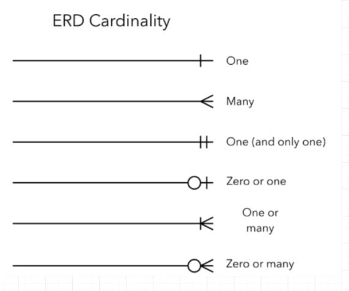
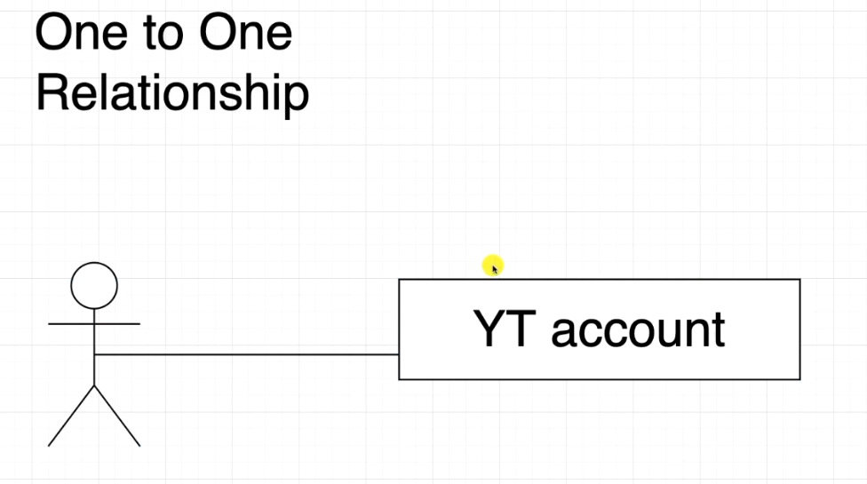
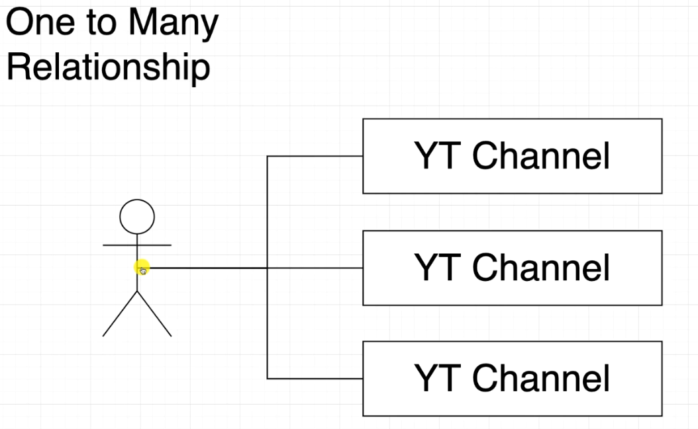
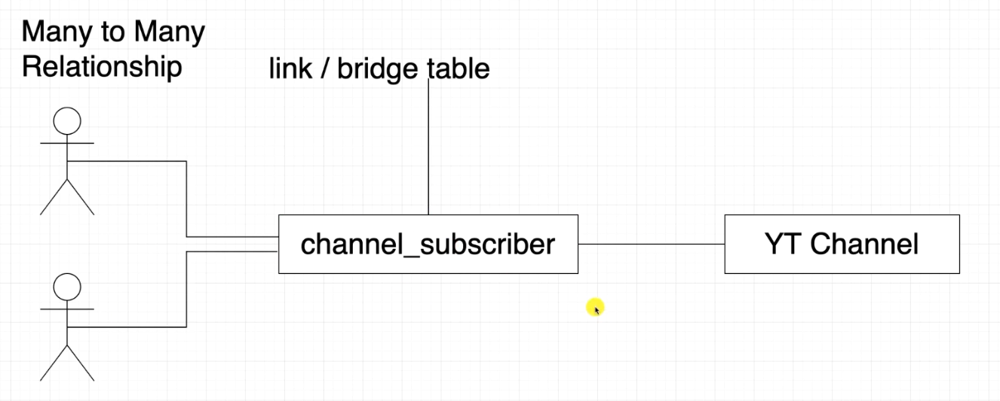
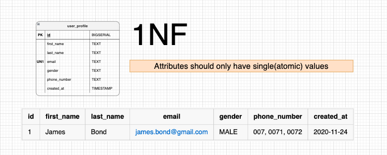
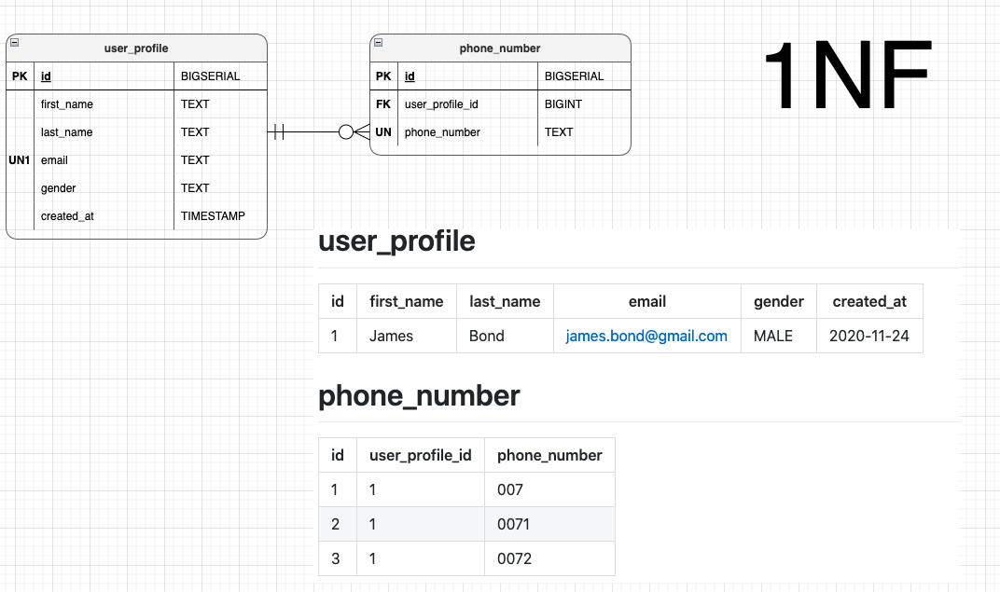
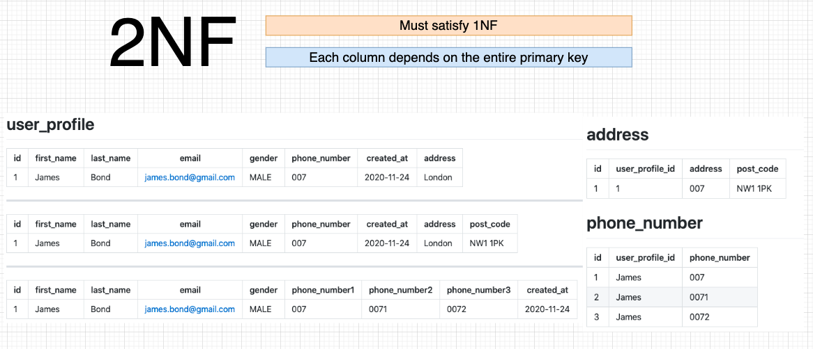
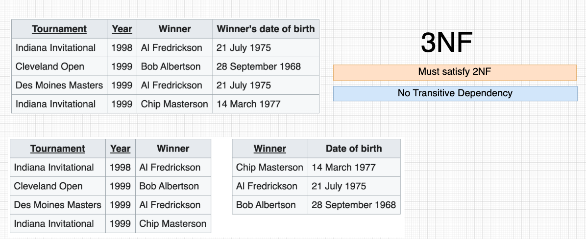

<!-- vscode-markdown-toc -->
* 1. [SQL](#SQL)
* 2. [Cardinality](#Cardinality)
	* 2.1. [One to One Relationship](#OnetoOneRelationship)
	* 2.2. [One to Many Relationship](#OnetoManyRelationship)
		* 2.2.1. [Primary Key vs Unique constraint](#PrimaryKeyvsUniqueconstraint)
	* 2.3. [Many to Many Relationship](#ManytoManyRelationship)
	* 2.4. [Database Normalization](#DatabaseNormalization)
		* 2.4.1. [1NF](#NF)
		* 2.4.2. [2NF](#NF-1)
		* 2.4.3. [3NF](#NF-1)

<!-- vscode-markdown-toc-config
	numbering=true
	autoSave=true
	/vscode-markdown-toc-config -->
<!-- /vscode-markdown-toc -->
# Amigoscode Database design and implementation

##  1. <a name='SQL'></a>SQL
```SQL
CREATE TABLE user_profile IF NOT EXISTS(
    id BIGSERIAL PRIMARY KEY, 
    first_name TEXT NOT NULL,
    last_name TEXT NOT NULL, 
    email TEXT UNIQUE NOT NULL,
    gender TEXT CHECK(gender IN ('MALE','FEMALE','OTHER')) NOT NULL,
    created_at TIMESTAMP WITHOUT TIME ZONE NOT NULL
);
```

##  2. <a name='Cardinality'></a>Cardinality
1. One to One
2. One to Many
3. Many to Many




###  2.1. <a name='OnetoOneRelationship'></a>One to One Relationship
```SQL
CREATE TABLE IF NOT EXISTS youtube_account(
    id BIGINT PRIMARY KEY REFERENCES user_profile(id),
    created_at TIMESTAMP WITHOUT TIME ZONE NOT NULL
);
```

###  2.2. <a name='OnetoManyRelationship'></a>One to Many Relationship
```SQL
CREATE TABLE IF NOT EXISTS youtube_channel(
    id BIGSERIAL PRIMARY KEY,
    youtube_account_id BIGINT NOT NULL  REFERENCES youtube_account(id),
    channel_name TEXT UNIQUE,
    created_at TIMESTAMP WITHOUT TIME ZONE NOT NULL
);
```
Here, youtube_account_id is not be unique. Which means, one youtube account can have multiple youtube channels. 

####  2.2.1. <a name='PrimaryKeyvsUniqueconstraint'></a>Primary Key vs Unique constraint
Primary key cannot be null, whereas unique constraint can have null. 


<br></br>
---

<br></br>
---



###  2.3. <a name='ManytoManyRelationship'></a>Many to Many Relationship
```SQL
CREATE TABLE IF NOT EXISTS channel_subscriber(
    youtube_account_id BIGINT REFERENCES youtube_account(id),
    youtube_channel_id BIGINT REFERENCES youtube_channel(id),
    created_at TIMESTAMP WITHOUT TIME ZONE NOT NULL,
    PRIMARY KEY(youtube_account_id, youtube_channel_id)
);
```
`PRIMARY KEY(youtube_account_id, youtube_channel_id)` This is called composite key. This means, youtube_account_id, youtube_channel_id combinely should be unique. 


###  2.4. <a name='DatabaseNormalization'></a>Database Normalization
- Used to reduce data redundancy and improve data integrity.+
- 1NF, 2NF, 3NF 

####  2.4.1. <a name='NF'></a>1NF

<br></br>
---
####  2.4.2. <a name='NF-1'></a>2NF

<br></br>
---
####  2.4.3. <a name='NF-1'></a>3NF

<br></br>
---

<br></br>
---