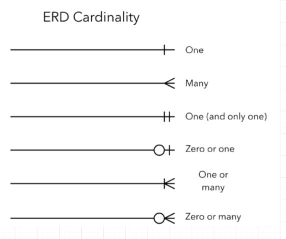
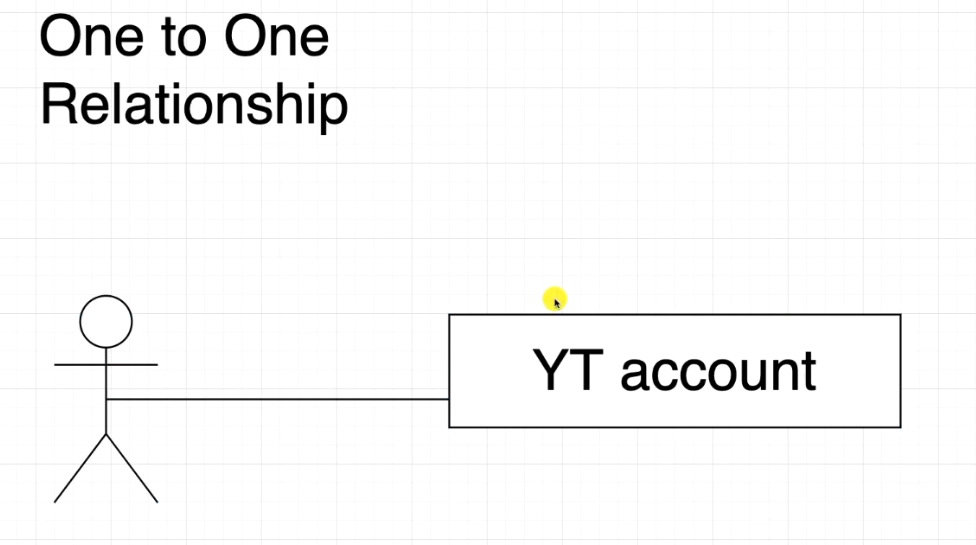
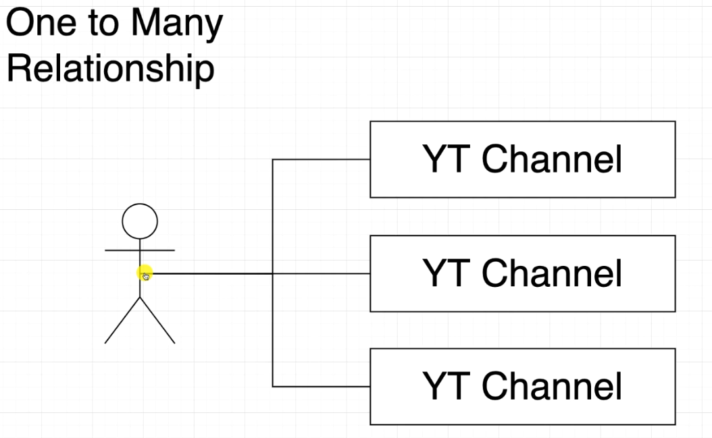
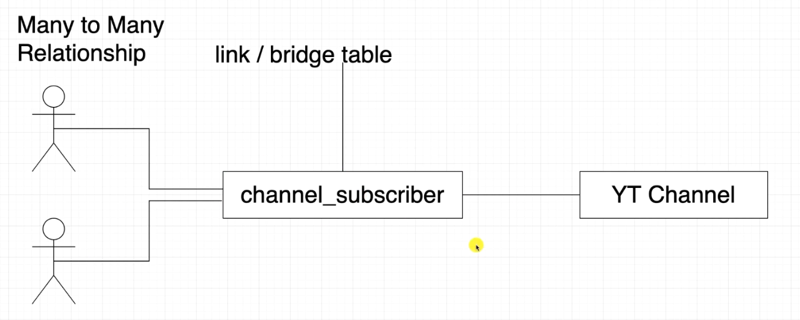
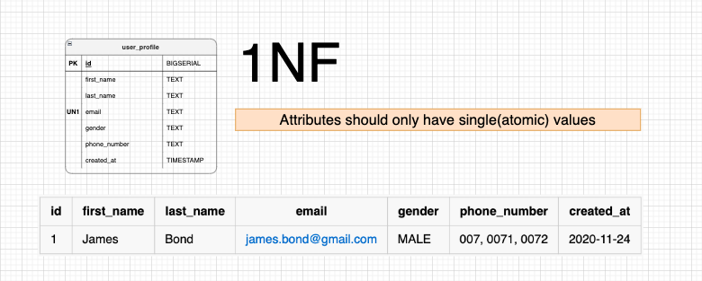
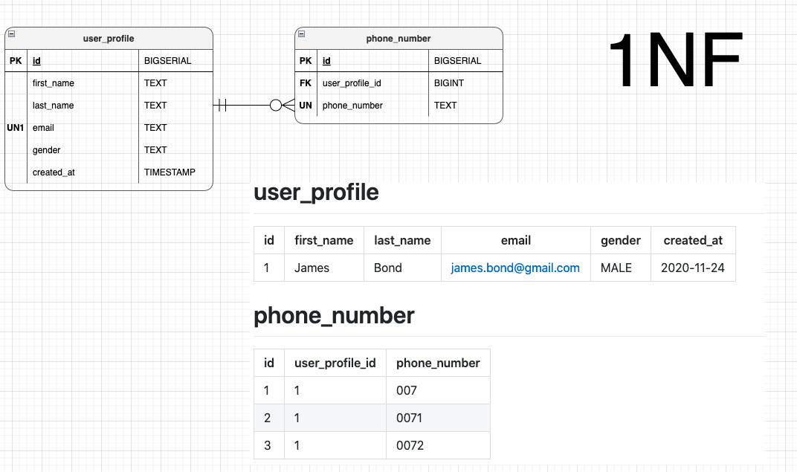
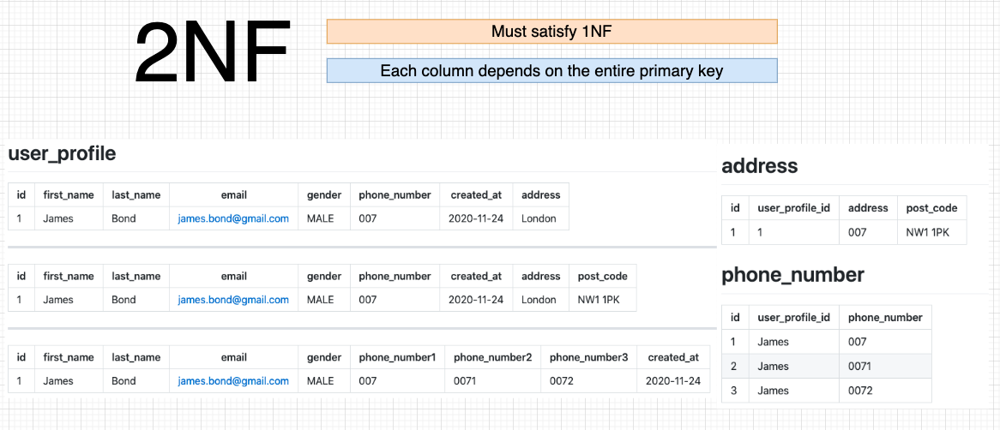
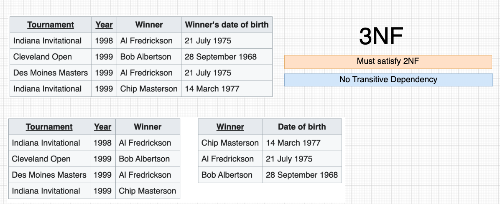

# Amigoscode Database design and implementation

## SQL for user_profile (refer [design](https://) file for design)
```SQL
CREATE TABLE user_profile IF NOT EXISTS(
    id BIGSERIAL PRIMARY KEY, 
    first_name TEXT NOT NULL,
    last_name TEXT NOT NULL, 
    email TEXT UNIQUE NOT NULL,
    gender TEXT CHECK(gender IN ('MALE','FEMALE','OTHER')) NOT NULL,
    created_at TIMESTAMP WITHOUT TIME ZONE NOT NULL
);
```

## Cardinality
1. One to One
2. One to Many
3. Many to Many




### One to One Relationship
```SQL
CREATE TABLE IF NOT EXISTS youtube_account(
    id BIGINT PRIMARY KEY REFERENCES user_profile(id),
    created_at TIMESTAMP WITHOUT TIME ZONE NOT NULL
);
```

### One to Many Relationship
```SQL
CREATE TABLE IF NOT EXISTS youtube_channel(
    id BIGSERIAL PRIMARY KEY,
    youtube_account_id BIGINT NOT NULL  REFERENCES youtube_account(id),
    channel_name TEXT UNIQUE,
    created_at TIMESTAMP WITHOUT TIME ZONE NOT NULL
);
```
Here, youtube_account_id is not be unique. Which means, one youtube account can have multiple youtube channels. 

#### Primary Key vs Unique constraint
Primary key cannot be null, whereas unique constraint can have null. 


<br></br>
---

<br></br>
---



### Many to Many Relationship
```SQL
CREATE TABLE IF NOT EXISTS channel_subscriber(
    youtube_account_id BIGINT REFERENCES youtube_account(id),
    youtube_channel_id BIGINT REFERENCES youtube_channel(id),
    created_at TIMESTAMP WITHOUT TIME ZONE NOT NULL,
    PRIMARY KEY(youtube_account_id, youtube_channel_id)
);
```
`PRIMARY KEY(youtube_account_id, youtube_channel_id)` This is called composite key. This means, youtube_account_id, youtube_channel_id combinely should be unique. 


### Database Normalization
- Used to reduce data redundancy and improve data integrity.+
- 1NF, 2NF, 3NF 

#### 1NF 

<br></br>
---

<br></br>
---

<br></br>
---

<br></br>
---